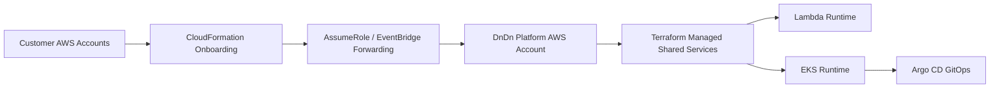

# DnDn-Infra

<div align="center">

### DnDn 플랫폼의 인프라 · Lambda · GitOps 운영 저장소

Terraform, CloudFormation, Lambda, Argo CD를 통해  
DnDn 플랫폼의 **where / how to run**을 관리합니다.


</div>

---

## 소개

`DnDn-Infra`는 DnDn 플랫폼의 AWS 인프라, 운영 Lambda, GitOps 선언, 운영 문서를 관리하는 저장소입니다.

현재 기준으로 이 저장소가 실제로 맡는 역할은 아래 네 축입니다.

1. 고객 AWS 계정 온보딩용 CloudFormation
2. 플랫폼 공통 인프라용 Terraform
3. 운영 Lambda 소스 및 배포 워크플로우
4. EKS 앱 배포용 Argo CD / GitOps 선언

---

## 레포 경계

### 한 줄 요약

- `DnDn-Infra`는 **where / how to run** 을 관리합니다.
- `DnDn-App`, `DnDn-HR`는 **what to run** 을 관리합니다.

### 실무 기준으로 보면

| Repo | Owns | Does Not Own |
|---|---|---|
| `DnDn-Infra` | AWS 자원, GitOps 선언, 환경별 값, 운영 절차 | 제품 기능 로직, UI 로직 |
| `DnDn-App` | 메인 서비스 코드, API, worker, report, contracts, 이미지 | AWS 자원 생성, Argo CD 선언, EKS 직접 배포 |
| `DnDn-HR` | HR 포털 UI와 이미지 | 플랫폼 공통 인프라, 메인 API 배포, EKS 직접 배포 |

---

## 현재 구조 한눈에 보기



---

## 이 레포가 관리하는 핵심 영역

### 1) Customer Onboarding
고객 계정에는 `cloudformation/dndn-ops-agent-role.yaml`을 배포합니다.

이 스택은 다음 역할을 합니다.

- `DnDnOpsAgentRole`
- 플랫폼 계정의 `AssumeRole`
- 플랫폼 EventBridge로의 이벤트 전달

### 2) Shared AWS Infrastructure
플랫폼 공통 인프라는 현재 `terraform/envs/prod`가 실제 운영 기준입니다.

현재 prod에서 조립되는 주요 모듈:

- `vpc`
- `security_groups`
- `bastion`
- `ecr`
- `rds`
- `eks`
- `sqs`
- `s3`
- `lambda`
- `cognito`
- `eventbridge`
- `route53`
- `acm`
- `iam_irsa`
- `app_secrets`
- `alb_controller`
- `s3_public`

### 3) Lambda Runtime
현재 Lambda 소스는 아래 두 축으로 나뉩니다.

- `lambda/event-enricher`
  - `finding_enricher`
  - `health_enricher`
  - `event_router`
- `lambda/scheduler-trigger`
  - EventBridge Scheduler에서 API `/reports/summary` 호출

### 4) EKS Application Runtime
현재 GitOps manifest 기준 prod 워크로드:

- `dndn-web`
- `dndn-api`
- `dndn-worker`
- `dndn-report-api`
- `dndn-report-worker`
- `dndn-hr`
- `dndn-monitoring`

---

## Current Paths

운영 / 유지보수 시 자주 보는 경로는 아래 정도면 충분합니다.

```text
cloudformation/
terraform/envs/prod/
terraform/envs/dev/
terraform/modules/
lambda/event-enricher/
lambda/scheduler-trigger/
gitops/bootstrap/
gitops/apps/
gitops/environments/prod/
gitops/environments/dev/
.github/workflows/
docs/
```

---

## 배포 순서

현재 안전한 운영 순서는 아래와 같습니다.

1. 플랫폼 계정 Terraform 적용
2. CloudFormation 템플릿 업로드 및 고객 계정 온보딩
3. Lambda 코드 배포
4. Argo CD root / child app 상태 확인
5. 앱 이미지 반영
6. 런타임 검증

### 핵심 원칙
- AWS 공통 자원이 먼저 준비되어야 합니다.
- 고객 계정은 플랫폼 EventBridge ARN이 준비된 뒤 연결합니다.
- Lambda 코드는 Terraform과 별도로 배포합니다.
- 앱 이미지는 Git manifest를 갱신하면 Argo CD가 반영합니다.

---

## GitOps 운영 방식

### Prod Environment
`gitops/environments/prod`는 `prod` 환경용 GitOps manifest를 담습니다.

현재 주요 경로:

- `apps/dndn-web`
- `apps/dndn-api`
- `apps/dndn-worker`
- `apps/dndn-report`
- `apps/dndn-hr`
- `apps/monitoring`
- `root/`

### Sync Order
최초 bootstrap 또는 root app 복구가 필요할 때는 아래 진입점을 먼저 적용합니다.

```bash
kubectl apply -f gitops/bootstrap/root-app-prod.yaml -n argocd
```

현재 기대 순서는 아래와 같습니다.

1. `platform` AppProject
2. `dndn-external-secrets`
3. `aws-secretsmanager` ClusterSecretStore
4. child app (`dndn-api`, `dndn-report`, `dndn-web`, `dndn-worker`, `dndn-hr`, `dndn-monitoring`)

---

## 운영 체크 포인트

### Argo CD 기본 확인
```bash
kubectl get applications -n argocd
kubectl get application dndn-prod-root -n argocd
kubectl get application dndn-external-secrets -n argocd
kubectl get application dndn-monitoring -n argocd
```

### 기대 상태
- `dndn-prod-root`: `Synced`, `Healthy`
- child app: `Synced`, `Healthy`
- `dndn-external-secrets`: `Synced`, `Healthy`
- `dndn-monitoring`: `Synced`, `Healthy`

---

## 앱 저장소와의 연결 방식

앱 레포의 책임은 아래처럼 나뉩니다.

- [`DnDn-App`](https://github.com/ACS-DnDn/DnDn-App)
  - `web`, `api`, `worker`, `report`, `contracts`
  - Docker 이미지 빌드 및 ECR 푸시
- [`DnDn-HR`](https://github.com/ACS-DnDn/DnDn-HR)
  - HR 포털 프론트엔드 이미지 빌드 및 ECR 푸시
- [`DnDn-Infra`](https://github.com/ACS-DnDn/DnDn-Infra)
  - 인프라 생성, 배포 선언, 운영 절차, 환경별 설정

즉, 앱 레포는 **실행 산출물**을 만들고, 이 레포는 그 산출물이 올라갈 **AWS / Kubernetes 런타임과 배포 경로**를 관리합니다.

---

## 현재 환경 상태

### Prod
- 현재 유일한 실제 운영 기준 환경
- Terraform 자동 적용 대상
- GitOps manifest 기준 운영 기준선

### Dev
- `terraform/envs/dev` scaffold는 코드상 준비되어 있음
- 아직 workflow나 실제 backend/state까지 연결된 활성 환경은 아님

---

## Docs

운영 시 아래 문서부터 보는 것을 추천합니다.

- [`docs/architecture.md`](./docs/architecture.md)  
  전체 구조, 레포 책임, 워크로드 기준
- [`docs/operations-runbook.md`](./docs/operations-runbook.md)  
  배포 순서, GitOps 흐름, 운영 점검
- [`gitops/environments/prod/README.md`](./gitops/environments/prod/README.md)  
  prod GitOps 디렉터리 로컬 안내

---

## 이 레포의 성격

### 강점
- 저장소 책임이 비교적 명확함
- 운영 문서가 이미 충분히 실무형으로 정리돼 있음
- 앱 레포와 Infra 레포의 역할 분리가 선명함
- GitOps 업데이트 경로가 명확함

### 이후 보강하면 좋은 것
- `prod` / `dev` 환경 차이 표
- bootstrap / 복구 절차를 다이어그램으로 보강
- Lambda 배포 / rollback 예시 추가
- 신규 기여자를 위한 “첫 진입 가이드” 추가

---

## 추천 GitHub About 문구

> Terraform, CloudFormation, Lambda, and Argo CD GitOps for the DnDn platform.

## 추천 Topics

`terraform` `cloudformation` `argocd` `gitops` `eks` `aws` `lambda` `infrastructure-as-code` `devops`
